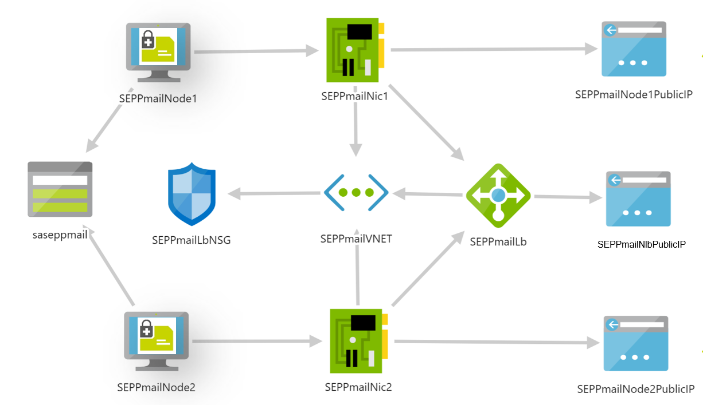

# SEPPmail Load-balancing Cluster

This ARM-Template lets you deploy a 2-node SEPPmail cluster, including a pre-configured
Azure Network Load Balancer. The virtual machines are created with the SEPPmail Marketplace VM images.

As of today (Feb 2021) we use the 'smvm12' image which represents SEPPmail Version 12.0.5.
Please see the schema graphic for a representation of the technical schema on VM´s and networking.

## Files

### SEPPmailLbCluster.json

This is the ARM-Template deploying the resources into your Azure Subscription. It should work without any parameters, because we have set default values in every parameter.

After a successful setup, the template will provide access details to the WebInterface, GINA and SMTP ports of the cluster. See output-section of the template for details.

### SEPPmailLbClusterParameters.json

ARM-Template parameter file. Use this file to change names, IP-Ranges and other parameters used in the template.

*Note*: You need to check if it is possible to deploy the resources in the region of your choice. Azure changes VM sizes from time to time, so adapt the parameters in the parameterfile accordingly. Otherwise deployment will fail.

### deploy.ps1

Example deployment script in Powershell. You could use Az-CLI as well, it would produce the same results.
This example creates one resource group and deploys all resources in this group. If you want to change the deployment location or the resource group name, change it to your needs inside deploy.ps1.

Refer to our video on ARM Template deployment here https://www.youtube.com/watch?v=VSCahCgOMgQ
